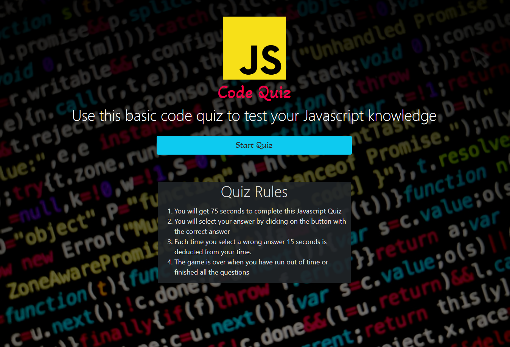

# JS Code Quiz

## Description

This app is a timed coding quiz with multiple-choice questions. This app will run in the browser, and will feature dynamically updated HTML and CSS powered by JavaScript

---

## Table of Contents (Optional)

- [Usage](#usage)
- [Links](#links)
- [License](#license)
- [Contact](#questions)

---

## Usage

Use this basic code quiz to test your Javascript knowledge.

- You will get 75 seconds to complete this Javascript Quiz
- You will select your answer by clicking on the button with the correct answer
- Each time you select a wrong answer 15 seconds is deducted from your time.
- The game is over when you have run out of time or finished all the questions

---
## Links
* [Github](https://github.com/ryanhadfield)
* [Deployed App](https://ryanhadfield.github.io/Code-Quiz/)

---

## License

Copyright (c) Ryan Hadfield. All rights reserved.
  
Licensed under the [MIT](LICENSE) license.

---

## Questions

Github: https://github.com/ryanhadfield

Email: Ryan.Hadfield@gmail.com